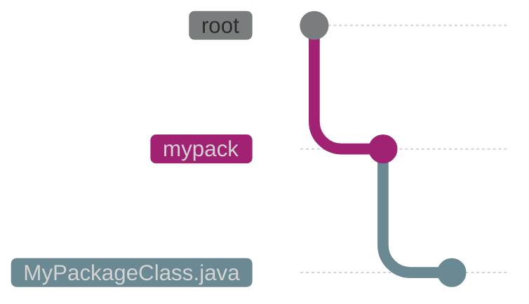

import u [[Java]]

###### Java libs
#lib_java
>library je kolekcija precompajlovanih classa, interface... koje mozes da importujes kako ne bi morao da iznova i iznova pravis iste klase, nego samo mozes da upotrebis stare. Podeljena je u;
>- packages
>- clasees

mozes da importujes ceo package ili samo jednu classu
```java
import package.name.Class;   // Import a single class
import package.name.*;   // Import the whole package
```
`import` je rec koja se koristi da uvezemo classe ili pakete u nas program

>Java Standard Library, dolazi u paketu sa JDK i nudi puno osnovnih funkcionalnosti

###### Packages
>A package in Java is used to group related classes. Think of it as **a folder in a file directory**. We use packages to avoid name conflicts, and to write a better maintainable code. Packages are divided into two categories:
>- Built-in Packages (packages from the Java API)
>- User-defined Packages (create your own packages)

>User-defined Packages, to create your own package, you need to understand that Java uses a file system directory to store them. Just like folders on your computer:



==To create a package, use the `package` keyword==
```java
package mypack;
class MyPackageClass {
  public static void main(String[] args) {
    System.out.println("This is my package!");
  }
}
```
zatim compilujes kao normalnu classu
```bash
$ javac MyPackageClass.java
```
**Note:** The package name should be written in lower case to avoid conflict with class names.

da ga pokrenemo:
```bash
$ java mypack.MyPackageClass
```
output: This is my package!